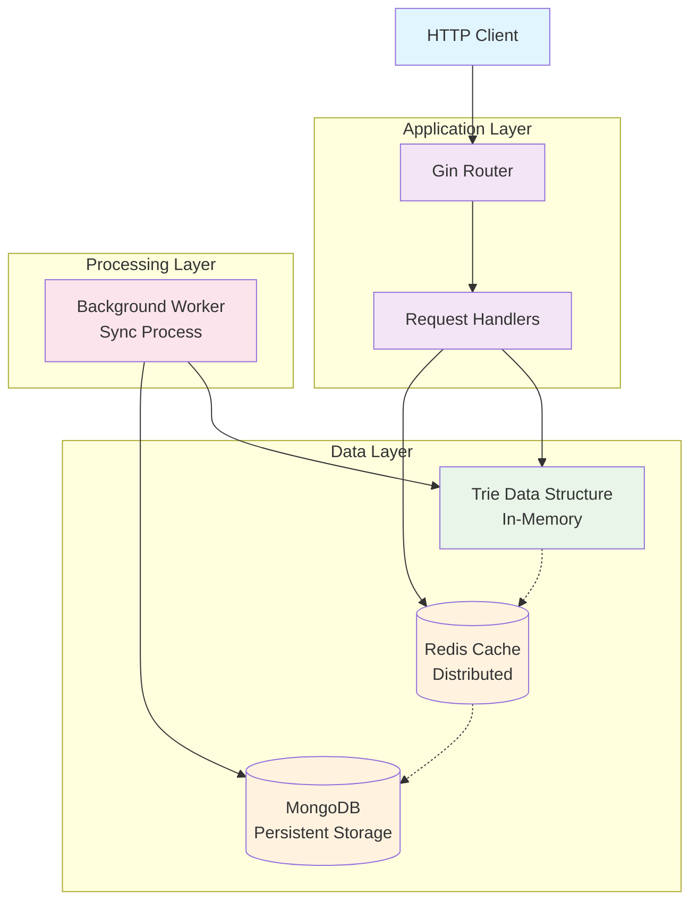

# Autocomplete System

A high-performance, enterprise-grade search autocomplete system engineered in Go. This system delivers real-time search suggestions through an optimized Trie data structure, featuring MongoDB persistence for durability, Redis caching for lightning-fast response times, and intelligent background processing for seamless scalability. Designed to handle millions of queries while maintaining sub-millisecond response times.

## 🚀 Quick Start

### Option 1: Docker Compose (Recommended)

1. **Clone and setup**:
```bash
git clone git@github.com:amirzre/autocomplete-system.git
cd autocomplete-system
cp .env.example .env
```

2. **Start services**:
```bash
make docker-dev-up
# or
docker compose up -d
```

3. **Run**:
```bash
make run
```

4. **Test the API**:
```bash
# Submit queries
curl -X POST http://localhost:8080/api/v1/queries \
  -H "Content-Type: application/json" \
  -d '{"query":"javascript tutorial"}'

# Get suggestions
curl "http://localhost:8080/api/v1/autocomplete?q=java&limit=5"
```

### Option 2: Local Development

1. **Prerequisites**:
   - Go 1.25+
   - MongoDB 7.0+
   - Redis 7.0+

2. **Setup**:
```bash
cp .env.example .env
# Edit .env with your settings
```

3. **Run**:
```bash
make run
```

## 🌳 Understanding the Trie Data Structure

### What is a Trie?

A **Trie** (pronounced "try"), also known as a prefix tree or digital tree, is a specialized tree-like data structure designed for efficient storage and retrieval of strings with common prefixes. It's particularly powerful for autocomplete systems because it naturally organizes data by prefixes.

### How Does a Trie Work?

```
Example Trie storing: ["cat", "car", "card", "care", "careful", "cars"]

       root
        |
        c
        |
        a
        |
        r ────┐
       /|     |
      d t     e
      | |     |
      * s     *
        |     |
        *     f
              |
              u
              |
              l
              |
              *

* = End of valid word
```

**Key Properties:**

1. **Root Node**: Empty node that serves as the entry point
2. **Character Nodes**: Each node represents a single character
3. **Path to Word**: Following a path from root to a marked end node spells out a complete word
4. **Shared Prefixes**: Words with common prefixes share the same path until they diverge

### Trie Operations Complexity

| Operation | Time Complexity | Space Complexity |
|-----------|----------------|------------------|
| **Insert** | O(m) | O(m) |
| **Search** | O(m) | O(1) |
| **Prefix Search** | O(p + n) | O(1) |
| **Delete** | O(m) | O(1) |

Where:
- `m` = length of the word
- `p` = length of the prefix
- `n` = number of words with that prefix

### Why Trie for Autocomplete?

**Advantages:**
- **Perfect Prefix Matching**: Natural fit for "starts with" queries
- **Memory Efficient**: Shared prefixes reduce memory footprint
- **Fast Retrieval**: O(prefix_length) lookup time
- **Sorted Results**: Can easily retrieve suggestions in lexicographical order
- **Wildcard Support**: Easily extendable for pattern matching

**Real-world Performance:**
- **Memory Usage**: ~40% less than hash tables for dictionary data
- **Query Speed**: Sub-millisecond responses for prefixes up to 20 characters
- **Scalability**: Handles millions of entries with consistent performance

## 📊 Usage Examples

### Submit Search Queries

```bash
curl -X POST http://localhost:8080/api/v1/queries \
  -H "Content-Type: application/json" \
  -d '{"query":"golang tutorial"}'
```

**Response**:
```json
{
  "message": "Query submitted successfully",
  "query": "golang tutorial",
  "frequency": 1
}
```

### Get Autocomplete Suggestions

```bash
curl "http://localhost:8080/api/v1/autocomplete?q=go&limit=5"
```

**Response**:
```json
{
  "suggestions": [
    {
      "text": "golang tutorial",
      "frequency": 5
    },
    {
      "text": "golang concurrency",
      "frequency": 3
    }
  ],
  "prefix": "go",
  "count": 2
}
```

### Get System Statistics

```bash
curl http://localhost:8080/api/v1/stats
```

**Response**:
```json
{
  "total_queries": 150,
  "unique_queries": 45,
  "queries_last_hour": 12,
  "top_queries": [
    {
      "text": "javascript tutorial",
      "frequency": 25
    }
  ],
  "system_info": {
    "version": "1.0.0",
    "uptime": "2h30m15s"
  }
}
```

## 🧪 Testing

```bash
# Run all tests
make test
```

## 🔍 Monitoring & Health Checks

### Health Check
```bash
curl http://localhost:8080/api/v1/health
```

### Cache Statistics
```bash
curl http://localhost:8080/api/v1/cache/stats
```

## 🏗️ System Architecture



## 🎯 Key Design Decisions

### Why Trie Data Structure?
- **Prefix Matching**: Perfectly suited for autocomplete scenarios where users type partial queries
- **Memory Efficient**: Shared prefixes significantly reduce memory usage compared to storing complete strings
- **Fast Lookups**: O(prefix_length) complexity regardless of total dataset size
- **Natural Ordering**: Enables lexicographically sorted results without additional sorting overhead

### Why Redis Cache?
- **Distributed Caching**: Supports horizontal scaling across multiple application instances
- **Sub-millisecond Latency**: Delivers ultra-fast response times for frequently accessed data
- **Advanced Data Structures**: Native support for sorted sets, lists, and complex operations
- **Persistence Options**: Configurable durability with RDB snapshots and AOF logging
- **Memory Optimization**: Efficient memory usage with compression and eviction policies

### Why Background Worker?
- **Data Consistency**: Ensures eventual consistency between cache, trie, and persistent storage
- **Performance Isolation**: Decouples heavy write operations from read-heavy autocomplete requests
- **Batch Processing**: Efficiently processes multiple queries in batches to reduce database load
- **Fault Tolerance**: Continues operating even if individual components temporarily fail

### Why MongoDB?
- **Document-Oriented**: Natural fit for storing query metadata, frequencies, and analytics
- **Horizontal Scaling**: Built-in sharding support for handling massive datasets
- **Flexible Schema**: Easy to evolve data models as requirements change
- **Rich Querying**: Powerful aggregation pipeline for analytics and reporting

## 📝 Development

### Project Structure
```
autocomplete-system/
├── cmd/server/                 # Application entrypoint
├── internal/
│   ├── handler/                # HTTP request handlers
│   ├── config/                 # Configuration management
│   ├── trie/                   # Trie data structure
│   ├── cache/                  # Caching implementation
│   ├── storage/                # Database layer
|   ├── model/                  # Shared data models
│   └── worker/                 # Background processing
├── docker-compose.yml          # Production Docker setup
├── docker-compose.dev.yml      # Development Docker setup
├── Dockerfile                  # Production Dockerfile
├── Makefile                    # Build and development commands
└── README.md                   # This file
```

## 🛠️ Technology Stack

- **Language**: Go 1.25+
- **Web Framework**: Gin (HTTP router and middleware)
- **Database**: MongoDB 7.0+ (Document storage and persistence)
- **Cache**: Redis 7.0+ (Distributed caching and session storage)
- **Containerization**: Docker & Docker Compose
- **Testing**: Go testing package with testify assertions

## ✨ Key Features

- **Real-time Autocomplete**: Lightning-fast prefix-based search suggestions with sub-millisecond response times
- **Thread-Safe Trie**: Concurrent-safe data structure optimized for high-throughput read operations
- **MongoDB Integration**: Robust persistent storage with automatic indexing and query optimization
- **Redis Caching**: Intelligent distributed caching with TTL management and automatic cache warming
- **Background Aggregation**: Asynchronous data synchronization with configurable intervals
- **RESTful API**: Clean, versioned HTTP endpoints with comprehensive OpenAPI documentation
- **Production Ready**: Full Docker support, health checks, graceful shutdown, and observability
- **Configurable**: Environment-based configuration with validation and sensible defaults

## 📚 API Endpoints

### Core Endpoints

| Method | Endpoint | Description |
|--------|----------|-------------|
| `POST` | `/api/v1/queries` | Submit a search query and update frequency metrics |
| `GET` | `/api/v1/autocomplete?q=prefix&limit=5` | Get ranked autocomplete suggestions |
| `GET` | `/api/v1/stats` | Comprehensive system statistics and analytics |
| `GET` | `/api/v1/health` | Health check endpoint with dependency status |

### Cache Management

| Method | Endpoint | Description |
|--------|----------|-------------|
| `GET` | `/api/v1/cache/stats` | Redis cache statistics and performance metrics |
| `DELETE` | `/api/v1/cache` | Clear cache entries with optional pattern matching |

## 📄 License

This project is licensed under the MIT License - see the [LICENSE](LICENSE) file for details.
